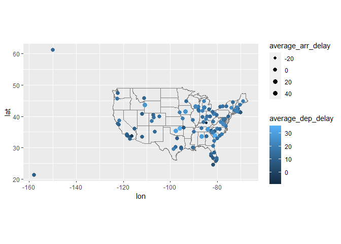
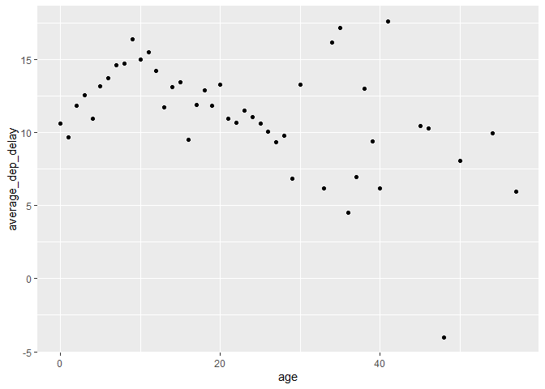
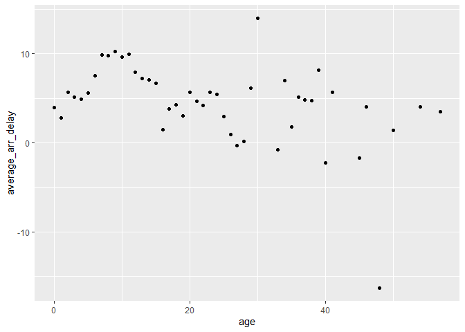

HW3
================
Andrew Li
10/15/2022

### Compute the average delay by destination, then join on the airports data frame so you can show the spatial distribution of delays.

``` r
delay_airports = flights %>%
  group_by(dest) %>%
  summarise(average_arr_delay = mean(arr_delay, na.rm=T),
            average_dep_delay = mean(dep_delay, na.rm=T)) %>%
  right_join(airports, c("dest" = "faa"))

delay_airports %>%
  semi_join(flights) %>%
  ggplot(aes(lon, lat)) +
    borders("state") +
    geom_point(aes(size = average_arr_delay, color=average_dep_delay)) +
    scale_size_continuous(range=c(1.5, 3)) +
    coord_quickmap()
```

    ## Joining, by = "dest"

    ## Warning: Removed 1 rows containing missing values (geom_point).

<!-- -->

### Add the location of the origin and destination (i.e. the lat and lon) to flights

``` r
flights_location = flights %>%
  left_join(select(airports, lat, lon, faa), by=c("dest" = "faa")) %>%
  left_join(select(airports, lat, lon, faa), by=c("origin" = "faa"))
flights_location
```

    ## # A tibble: 336,776 x 23
    ##     year month   day dep_time sched_dep_time dep_delay arr_time sched_arr_time
    ##    <int> <int> <int>    <int>          <int>     <dbl>    <int>          <int>
    ##  1  2013     1     1      517            515         2      830            819
    ##  2  2013     1     1      533            529         4      850            830
    ##  3  2013     1     1      542            540         2      923            850
    ##  4  2013     1     1      544            545        -1     1004           1022
    ##  5  2013     1     1      554            600        -6      812            837
    ##  6  2013     1     1      554            558        -4      740            728
    ##  7  2013     1     1      555            600        -5      913            854
    ##  8  2013     1     1      557            600        -3      709            723
    ##  9  2013     1     1      557            600        -3      838            846
    ## 10  2013     1     1      558            600        -2      753            745
    ## # ... with 336,766 more rows, and 15 more variables: arr_delay <dbl>,
    ## #   carrier <chr>, flight <int>, tailnum <chr>, origin <chr>, dest <chr>,
    ## #   air_time <dbl>, distance <dbl>, hour <dbl>, minute <dbl>, time_hour <dttm>,
    ## #   lat.x <dbl>, lon.x <dbl>, lat.y <dbl>, lon.y <dbl>

### Is there a relationship between the age of a plane and its delays?

``` r
age_flights = planes %>%
  mutate(age = 2013 - year) %>%
  select(age, tailnum) %>%
  right_join(flights, by="tailnum") %>%
  group_by(age) %>%
  summarise(average_dep_delay = mean(dep_delay, na.rm=T),
            average_arr_delay = mean(arr_delay, na.rm=T))
age_flights %>%
  ggplot(aes(x = age, y = average_dep_delay)) +
  geom_point()
```

    ## Warning: Removed 1 rows containing missing values (geom_point).

<!-- -->

``` r
age_flights %>%
  ggplot(aes(x = age, y = average_arr_delay)) +
  geom_point()
```

    ## Warning: Removed 1 rows containing missing values (geom_point).

<!-- -->

We can see that there is no clear relationship between the age of the
plane and the delays that it suffers.
